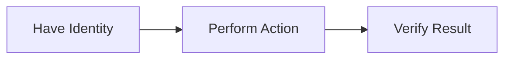

# Onboarding guide

To onboard a user to a Canton network, you need to follow a specific sequence of steps because each action depends on the previous one.

At a high level, the workflow looks like this:



* **Have Identity**
  Every interaction with the ledger must be performed by a Party. You either use an existing Party ID or create a new one.

* **Perform Action**
  Once you have a Party ID, you can submit a transaction (command) on behalf of that Party.

* **Verify Result**
  After submitting the transaction, you query the ledger to confirm that the expected change occurred.

This order is required because:

* You cannot submit a transaction without a Party ID
* You cannot verify results without first submitting a transaction

This guide walks you through how to onboard a user to a Canton network using the available HTTP APIs.


By the end of this guide, you will be able to take a Party ID and use it to successfully perform and verify an action on the Canton ledger.


## Prerequisites

Before you begin, ensure you have the following:

#### 1. Access to the API

You need access to a running [Canton Participant Node that exposes the HTTP JSON API](https://docs.digitalasset.com/build/3.4/quickstart/operate/json-api.html).

This is required to:

* Allocate Parties
* Submit commands
* Query ledger state

#### 2. A Valid JWT Token

All requests must include a [JWT token for authentication in Canton APIs](https://docs.digitalasset.com/build/3.5/explanations/json-api/index.html#json-api-access-tokens)


```http
Authorization: Bearer <JWT_TOKEN>
```

The token must have permission to:

* Act as the Party you are using
* Submit commands
* Query contracts

#### 3. A Signed Transaction Payload

To submit a command, you need a [signed transaction payload](https://docs.digitalasset.com/build/3.4/tutorials/app-dev/external_signing_submission.html#api).

This payload:

* Defines the action to perform (for example, create or update a contract)
* Is generated and signed using Canton/Daml tooling

> This guide assumes you already have a valid signed payload.

## Workflow

### Step 1: Ensure a Party ID is Available

Before you can interact with the Canton ledger, you need a **Party ID**.
This represents the identity under which all actions will be performed.

* If you already have a Party ID, you can use it directly and skip this step
* If not, you can create one using the endpoint below

> Think of a Party ID as the identity you act on behalf of when submitting transactions.

For full request parameters and response details, see the API reference.

<a
  class="button button--primary"
  href="/docs/api/allocate-party"
  target="_blank"
>
  Try Allocate Party API
</a>


:::tip[Note:]
 * The `party` field is the **unique Party ID**
 * Store this value securely, you will need it in the next steps.
:::

> If you already had a Party ID before this step, you can proceed using that value instead.


### Step 2: Submit a Command (Transaction)

Once you have a Party ID, you can submit a command to perform an action on the ledger.

This request sends a **signed transaction** to the network under a specific Party.

For full request parameters and response details, see the API reference.

<a
  class="button button--primary"
  href="/docs/api/submit-command"
  target="_blank"
>
  Try Submit a Command API
</a>

#### What happens next

If successful:

* The transaction is processed by the ledger
* New contracts may be created or existing ones updated

You will verify this in the next step.


### Step 3: Query Active Contracts

After submitting a command, you should confirm the result by querying the ledger.

This endpoint returns all **active contracts visible to a Party**.

For full request parameters and response details, see the API reference.

<a
  class="button button--primary"
  href="/docs/api/get-active-contracts"
  target="_blank"
>
  Try Query Active Contracts API
</a>

If the expected contract appears, the onboarding workflow was successful.


## Verification & Troubleshooting

If something does not work as expected, use the checks below:

| Issue                          | Troubleshooting Steps                                                                 |
|--------------------------------|----------------------------------------------------------------------------------------|
|  No contracts returned in Step 3 | - Confirm the transaction in Step 2 succeeded <br /> - Ensure the Party in the request matches the one used in Step 2 <br /> - Check that the transaction actually creates or updates a contract |
|  401 Unauthorized error       | - Verify your JWT token is valid <br /> - Ensure it includes permissions for: <br /> &nbsp;&nbsp;• Acting as the Party <br /> &nbsp;&nbsp;• Querying contracts |
|  404 or empty response        | - Confirm the Party ID is correct and not mistyped <br /> - Ensure the Party has visibility into the contracts <br /> - Check that you are querying the correct environment |
|  Transaction times out        | - Increase the `timeout` value <br /> - Ensure the network is running and responsive |